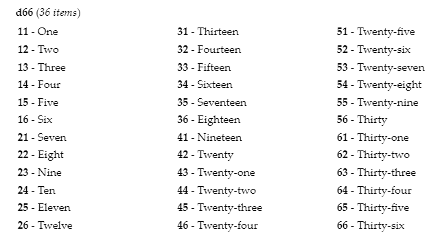

# RPG Build

This is a markdown preprocessor for generating roleplaying content in markdown format.

Web-app Version [here](https://mothteeth.com/apps/rpgbuild/) 

*Main functionality*:

- automatically generate html tables from unformatted lists of items.
- automatically assign dice roll-ranges to items based on item count.

It supports all standard polyhedral dice, d66, and d100 percentile tables, as well as a full-auto mode that attempts to find the best match for a given number of items. This automatic behaviour is useful during development, as it aids play testing with incomplete tables, and minimises maintenance time when adding or removing items.

*The following is a screenshot of a d66 table:*



## Installation

This script requires [nodejs](https://nodejs.org/). 

To install, run the following terminal command in the root directory of the project:

`npm install -g`

Now, the `rpgbuild` command should be globally available from the terminal.

## Usage: 

The config-free method of using the `rpgbuild` command is to supply it with an input file path as a commandline argument:

`rpgbuild my_rpg_game.md`

This will output the html file with the same name and path as the input file, but with the `.html` suffix.

To supply a custom output file path, provide a second argument specifying the path for the output file. (Note: should have the `.htm` `.html` suffix to generate a file you can open in a browser.)

`rpgbuild my_rpg_game.md my_directory/my-awesome-game.html`

Note that you can use doublequotes to refer to documents with spaces in their names:

`rpgbuild "filename with spaces.md".md "My Game.html"`

### Configure Jobs with `rpgbuild.json`

To configure more complex projects, or combine multi-file documents, you can specify one or more "jobs" within a JSON file called `rpgbuild.json`. 

You can configure one or more jobs in `rpgbuild.json`.

    [
      {
        "sourceFile": "../My RPG Game.md",
        "outputFile": "../www/game_rules.html",
        "title": "Game Rules"
      },
      {
        "sourceFile": "../Tables.md",
        "outputFile": "../www/tables.html",
        "title": "Tables"
      },
      {
        "sourceFile": "../Suppliment 1.md",
        "outputFile": "../www/suppliment_1.html",
        "title": "Game Suppliment 1"
      }
    ]

`sourceFile` - the markdown file to be processed.  
`outputFile` - the destination file where the output should be saved.  
`title` - the title to be injected into the `<title>` tag of the output html document.  

To compile pages from multiple inputs, replace `sourceFile` with `sourceFiles`, an array of filenames:

    [
      {
        "sourceFiles": [
          "../Source file 1.md",
          "../Source file 2.md",
          "../Source file 3.md"
        ],
        "outputFile": "../www/game_rules.html",
        "title": "Game Rules"
      }
    ]


To build the output files, run the `rpgbuild` command in the same directory as the `rpgbuild.json` file, with no other arguments.

`rpgbuild`
    
The output html files will be saved to the location specified in `rpgbuild.json`. 

### CSS Style

The output html files contain a reference to an external style sheet, called `style.css`. The example project supplies an example style sheet, which can be customised as needed.

## Parser Syntax:

### D100 lists:

    [table_d100]
    Item A
    Item B
    Item C
    ...
    [end_table]

All lines between `[table_d100]` and `[end_table]` will be consumed for the list. 
Items should be un-numbered, and die roll ranges will be automatically calculated for each item. 

The number `100` is only evenly divisible by 100, 50, 25, 20, 10, 5, 2, 1, so roll ranges can not always be made to add up to a total of 100. Any "remainder" range at the end of the table will be populated by a "Roll Again" item. To avoid this, create lists with exactly 100, 50, 25, 20, or 10 items. 

### D66 lists:

D66 tables have 36 items.

    [table_d66]
    Item A
    Item B
    Item C
    ...
    [end_table]

Die numbers are automatically added. Unused table "slots" will be rendered, but left blank.

### Sequential List Table

To generate a table with sequentially numbered items:

    [table_seq]
    Item A
    Item B
    Item C
    ...
    [end_table]

For example, a table of twenty items will be numbered 1 - 20.

### Poly-die Auto
  
Attempts to find the best match for a list of items. If the list length is equal to any standard polyhedral die, it will print as a sequential list. If it contains 36 items, it will print as a d66 list. Odd-length lists will fall back on a d100 table, with a "Roll Again" padding option where necessary to maintain equal probabilities.

    [table_poly]
    Item A
    Item B
    Item C
    ...
    [end_table]

### Overriding the Default Columns Count:

The number of columns in a table can be controlled by adding a colon, and a number after the main command. 

Example, the following would produce a two column table, overriding the default.

    [table_d100:2]

### Set Internal Values

The `set` command can be used for setting values inside the parse.

**Example***, set default_columns to 1*:

    [set default_columns 1]

#### Valid `Set` Arguments:

`set default_columns 3` - set the default number of columns used when none is supplied.  

`set d66_spacer true/false` - enable spacers in d66 tables (between groups of six).  

`set render_die_type true/false` - display the die type at the top of the table.  

### Page Breaks

`[page_break]` - inserts a page break separator for print media. 

NOTE - uses the css: `page-break-after: always;`

This css is embedded into the output html. Override visibility or behaviour using the `.pagebreak` css class.


### Inline HTML / Raw input

Inline tables or other html content can be wrapped in `[raw]` and `[end_raw]` tags. The content inside will be passed through unprocessed, and ignored by the markdown processor.

**Example***, using* `[raw]` *to enter a custom table:*

    [raw]

    <table>
        <tr><td>XXX</td> <td>XXX</td> </tr>
        <tr><td>XXX</td> <td>XXX</td> </tr>
        <tr><td>XXX</td> <td>XXX</td> </tr>
    </table> 

    [end_raw]

### Outliner Notes

Some text editors that feature an "Outliner" that displays markdown headers in a sidebar for easy access. This feature allows users to display "Outline notes" in the outliner without including them in the final document.

Any header that starts with an @ symbol will be stripped.

*Example format:*
```
  # @ Outliner Note will be stripped
  ## @ Outliner Note will be stripped
  ### @ Outliner Note will be stripped
```
## License

RPG Build is released under the [GPLV3](https://www.gnu.org/licenses/gpl-3.0.en.html) License.

*Created by Lee Grey, in Aotearoa - The Land of the Long White Cloud*

